# 第1章 并发编程挑战

## 1.1 上下文切换

### 1.1.1 概念

多个线程并发执行时，当切换线程时，需要保存线程的状态，切回去时需要恢复原来的状态，此之为线程切换。线程切换会带来性能开销。

### 1.1.2 测试线程切换的工具

- vmstat  这个centos自己有
- Lmbench   这个需要装 [官网](http://www.bitmover.com/lmbench/)

### 1.1.3 如何减少上下文切换

- 无锁并发编程
- 使用CAS算法
- 使用最少的线程
- 使用协程


### 1.1.4 使用jstack能够dump线程信息

## 1.2 死锁

### 1.2.1 死锁问题排查

通过dump线程信息来排查

### 1.2.2 死锁的避免

- 避免同一个线程同时获取多个锁
- 避免一个线程在锁内占用多个资源，尽量只占用一个资源
- 尝试使用定时锁 tryLock
- 对于数据库锁，加锁和解锁必须在一个数据库连接里

## 1.3 资源限制

### 1.3.1 哪些资源限制

- 带宽上传下载速度
- 硬盘读写速度
- cpu处理速度
- 数据库连接数和socket连接数限制

### 1.3.2 解决方案


1. 集群
2. 连接池技术
3. 根据资源情况调整程序的并发度


# 第2章 java并发机制的底层实现原理

java代码执行流程

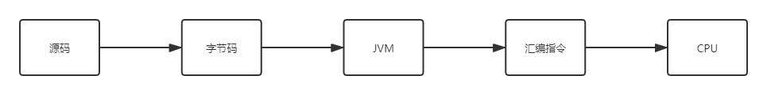

## 2.1 volatile

### 介绍

- 轻量级的synchronized，不会引起线程上下文切换
- 保证共享变量可见性，即一个线程修改共享变量时，其他线程能读到修改后的值

### 原理

加volatile后编译成的汇编指令会多一个lock，然后cpu会对这个lock做一些特殊处理：

1. lock前缀指令会引起处理器缓存回写到内存
2. 一个处理器将缓存回写回内存会导致其他处理器缓存无效

### volatile使用优化

追加字节使得数据不在一个缓存行。java7及以上不可用。

## 2.2 synchronized原理与应用

### 2.2.1 synchronized的三种形式

1. 普通同步方法，锁为当前实例对象
2. 静态同步方法，锁为当前类的Class对象
3. 同步代码块，锁为（）里边的那个对象

### 2.2.2 原理

JVM基于进入和退出Monitor对象来实现方法同步和代码块同步。

### 2.2.3 对象头

synchronized的锁信息是存储在对象头中的，数组3个子宽存对象头，非数组2个子宽。64为机器 1子宽=8byte（64bit）

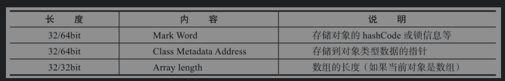


### 2.2.4 锁的升级与对比

jdk1.6 为提高性能引入 偏向锁-> 轻量级锁-> 重量级锁


锁能升级，不能降级


#### 偏向锁

- 概念

当一个线程访问同步块并获得了锁的时候，会在对象头的锁记录中存储偏向的线程id， 以后该线程进入或退出该同步块时不需要进行CAS操作来加锁和释放锁，只需要测试一下对象偏向锁里的id是不是自己的线程id，如果是就是获得了锁，不是就要看当前是不是偏向锁，不是偏向锁则cas竞争锁，否则该偏向锁里边的id为自己

- 好处

让同一个线程重复获取锁和释放锁的效率变高了

- 获取和撤销流程

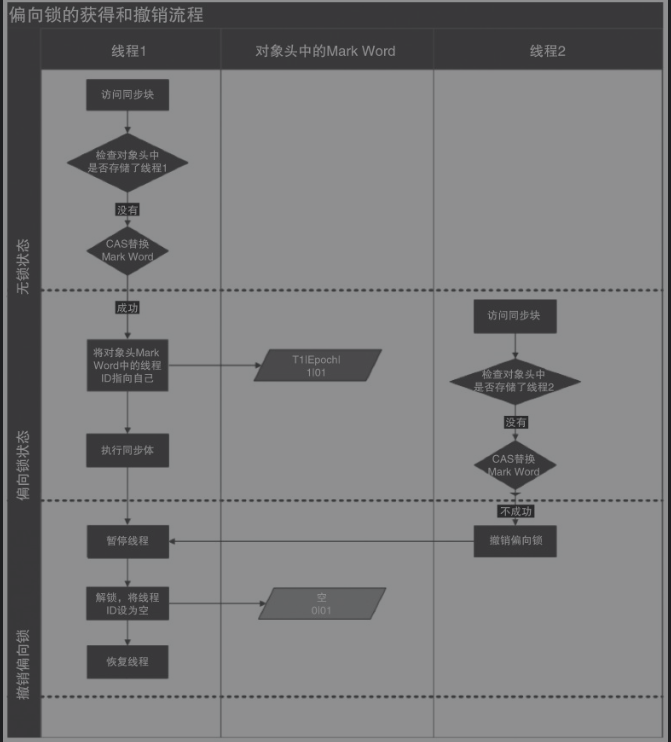


- 相关jvm参数

默认需要几秒后才激活偏向锁，可以通过如下参数设置无延迟

```
-XX:BiasedLockingStartupDelay=0
```

关闭锁

```
-XX:+UseBiasedLocking
```

#### 轻量级锁

- 锁的获取

线程进入同步代码块前，jvm会在当前线程的栈帧创建存储锁记录的空间，然后将对象头mark work拷贝到栈帧锁记录，然后尝试CAS将对象头锁记录执行栈帧锁记录，成功则获得锁，否则尝试利用自旋或则锁。


- 锁的释放

CAS将栈帧锁记录拷贝回对象头，成功则释放成功，否则膨胀成为重量级锁。

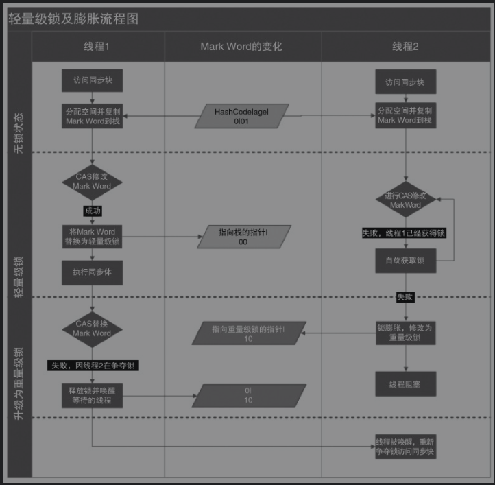

<center>轻量级锁及其膨胀流程</center>

#### 重量级锁

内置锁在Java中被抽象为监视器锁（monitor）。在JDK 1.6之前，监视器锁可以认为直接对应底层操作系统中的互斥量（mutex）。这种同步方式的成本非常高，包括系统调用引起的内核态与用户态切换、线程阻塞造成的线程切换等。因此，后来称这种锁为“重量级锁”。

#### 锁的对比


|锁|优点|缺点|适用场景|
|----|----|----------|----|
|偏向锁|同一个线程加锁解锁不需要额外消耗|如果存在竞争，会带来额外的锁撤销消耗|适用于只有一个线程访问同步块的场景|
|轻量级锁|竞争不会引起阻塞，提高了程序响应速度|长时间得不到锁的线程会一直自旋消耗cpu|追求响应时间，同步块执行速度快|
|重量级锁|竞争不自旋，不消耗cpu|线程阻塞，响应慢|追求吞吐量，同步块执行比较慢|


## 原子操作的实现原理

### 定义

不可中断的一个或一系列操作叫原子操作

### cpu如何实现原子操作

1. 使用总线锁
2. 通过缓存锁实现

### java如何实现原子操作

#### 使用循环CAS实现

##### 原子操作类

- AtomicBoolean
- AtomicInteger
- AtomicLong

他们基本头提供了compareAndSet、get、getAndSet 这样的方法

##### CAS实现原子操作的三大问题

- ABA问题

cas操作基于期望值是不是和之前的值是否一样来实现，可能存在一个一个值为A，然后变成B，然后又变为A， 此时会认为这个值没有变化，其实变化了。

解决方法：使用版本号，jdk也提供了AtomicStampedReference实现

- 循环时间长的话开销大

cas如果长时间不成功会给cpu带来很大的开销。

解决方法：支持cpu的pause指令

- 只能保证一个共享变量的操作

解决：想办法把几个变量合并成一个；使用jdk提供的AtomicReference保证引用对象之间的原子性


#### 使用锁来实现原子性

这没啥好说的


# 第3章 java内存模型

## 3.1 内存模型的基础

### 3.1.1并发编程模型中的两个关键问题

- 线程间如何通信

概念：如何交换信息

方式：
1. 共享内存，隐式通信
2. 消息传递，显示通信
- 线程间如何同步

概念：控制不同线程间操作发生的相对顺序的机制

共享内存并发模型中（java采用的方式）：同步是显示的，必须手动指定某个方法或某段代码需要互斥执行

消息传递并发模型中：同步是隐式的，消息发送必须在接受之前


### 3.1.2 Java内存模型抽象结构

- 所有实例变量、类变量、数组元素存在堆内存
- 堆内存在线程间共享
- 局部变量不共享，不存在可见性问题

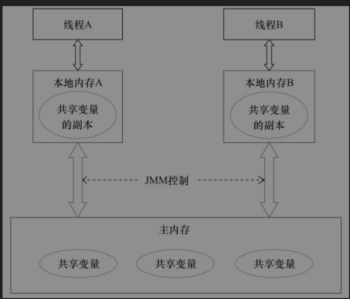

<center>java并发编程艺术-java内存模型的抽象结构</center>

> 图中本地内存是抽象的概念，并不真实存在


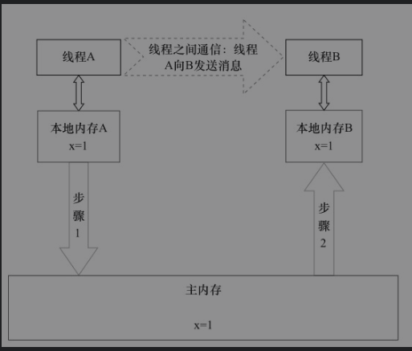

<center>java并发编程艺术-java线程通信模型</center>


### 3.1.3 从源代码到指令序列的重排序

1. 编译器优化的重排序
2. 指令级并行的冲排序
3. 内存系统的重排序

> 2、3属于处理器指令重排序

JMM（java memory model）通过内存屏障禁止特定类型的处理器重排序，保证内存可见性。


### 3.1.4 happens-before规则

如果一个操作的结果需要对另一个操作可见，必须满足happens-before规则

- 程序顺序规则：一个线程中的每个操作，happens-before于该线程的任意后续操作
- 监视器锁规则：对于一个锁的解锁，happens-before于随后对这个锁的加锁
- volatile变量规则：对于一个volatile的写，happens before于后续任意对他的读
- 传递性：如果A happens before 于B ，B hb于C，那么A hb 于C

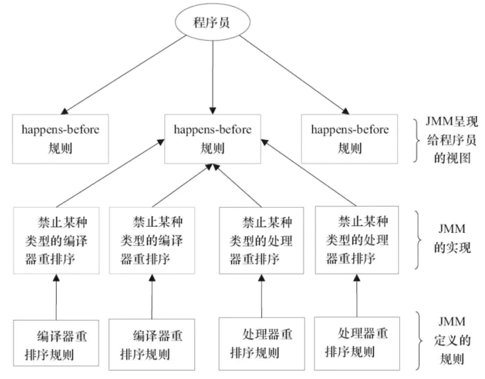

<center>happens-before</center>


## 3.2 重排序

重排序是编译器或处理器为了优化程序性能对指令序列进行重新排列的过程。

### 3.2.1 数据依赖性

两个操作访问同一个变量，并且至少有一个写操作，即存在数据依赖性。

编译器和处理器对单线程的存在数据依赖性的操作不会做冲排序，多线程的数据依赖性则不被考虑。

### 3.2.2 as-if-serial语义

意思是，无论如何重排序，单线程程序执行结果不能变，编译器和处理器都遵循子原则。

### 3.2.3 程序顺序规则

如果两个操作不具有数据依赖性，那么就是可以重排序的。

### 3.2.4 重排序对多线程的影响

单线程，无影响，多线程有影响。

> 这一节感觉说了一堆，其实就是说明了一个问题，编译器和cpu可能对指令重排序，存在数据依赖性的在单线程不会重排序，没问题，在多线程下会有问题。

## 3.3 顺序一致性

如果程序是正确同步的（synchronized, volatile, final），程序执行将具有顺序一致性;否则不具有顺序一致性。

JMM不保证对64为的long和double写操作的原子性， 查阅了一些资料：64为操作系统是能保证的 [参考资料](https://juejin.im/entry/595a43535188250d914dc7d3)；后文也说了 加volatile可以保证操作的原子性


## 3.4 volatile的内存语义

### 3.4.1 volatile的特性

对volatile变量的单独的读写可以看作是对变量的读写加了锁，也即是对volatile的读总能看到最后一个线程对他的写。

- 内存可见性。读volatile总能看到最新的
- 原子性：读写操作具有原子性，类似于volatile++的复合操作不具有原子性

### 3.4.2 volatile读-写内存语义

写内存语义：当写一个volatile变量时，JMM会将本地内存中的共享变量刷新到主内存中

读内存语义：当读一个volatile变量时，JMM会将本地内存的变量标识为无效，从主内存中读取


### 3.4.3 volatile内存语义的实现

简言之就是：编译器生成字节码时会通过加入内存屏障来阻止cpu对volatile变量读写操作的重排序。

书中提到了一篇参考文章[正确使用 Volatile 变量
](https://www.ibm.com/developerworks/cn/java/j-jtp06197.html)

volatile和锁的区别就是

锁能保证一组操作的原子性

但是volatile只能保证单个操作是原子的

## 3.5 锁的内存含义

### 3.5.1 锁的释放和获取的内存语义

和volatile是一样的

释放：释放时将本地内存中的共享变量刷到主内存
获取：获取时标识本地内存为无效，重新从主内存读取


### 3.5.2 锁内存的语义实现

ReentrantLock 实现依赖同步器框架AbstractQueuedSyncronizer(AQS),AQS使用整形volatile变量state维护同步状态。

- 公平锁和非公平锁释放时，最后都要写一个volatile变量state
- 公平锁获取时，都会先读volatile变量
- 非公平锁获取时，先使用CAS更新volatile，这个操作同时具有volatile读和写的内存语义

### 3.5.3 concurrent包的实现

实现基本模式

1. 声明共享变量为volatile
2. 使用CAS更新来实现线程同步，同时配合volatile读写内存语义和CAS读写内存语义实现线程通信


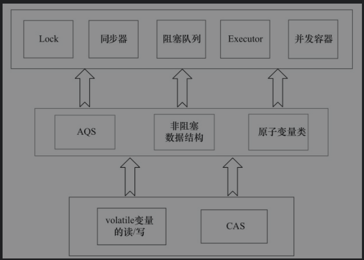

<center>java并发编程艺术-concurrent包实现基本原理</center>


## 3.6 final域的内存语义

### 3.6.1 final域重排序规则
- 在构造函数内对一个final域的写入，与随后把这个被构造对象的引用赋值给一个引用变量，这两个操作之间不能重排序
- 初次读一个包含final域的对象的引用，与随后初次读这个final域，这两个操作之间不能重排序

### 3.6.2 写final域的重排序规则

- JMM禁止编译器把final域的写重排序到构造函数之外
- 编译器会在final域的写之后，构造函数return之前，插入一个StoreStore屏障。这个屏障禁止处理器把final域的写重排序到构造函数之外

final域的重排序规则保证：

**在对象引用为任意线程可见之前，对象的final域已经被正确初始化过了，而普通域不具有这个保障**

### 3.6.3 读final域的重排序规则

在一个线程中，初次读对象引用与初次读该对象包含的final域，JMM禁止处理器重排序这两个操作

这个规则保证：

在读一个对象的final域之前，一定会先读包含这个final域的对象的引用

### 3.6.4 final域为引用类型

在构造函数内对一个final引用的对象的成员域的写入，与随后在构造函数外把这个被构造对象的引用赋值给一个引用变量，这两个操作之间不能重排序。


## 3.7 happens-before

### 3.7.1 JMM 的设计

设计考虑的因素

- 程序员：期望一个强内存模型。
- 编译器处理器：期望束缚少的弱内存模型
- JMM： 找到两者的平衡点

基本策略

- 会改变程序执行结果的重排序：禁止
- 不会改变执行结果的冲排序：允许

### 3.7.2 happens-before的定义

- 如果一个操作happens-before另一个操作，那么第一个操作的执行结果将对第二个操作可见，而且第一个操作的执行顺序排在第二个操作之前
- 如果重排序之后的执行结果，与按happens-before关系来执行的结果一致，那么这种重排序并不非法

### 3.7.3 happens-before规则

- 程序顺序规则：一个线程中的每个操作，happens-before于该线程中的任意后续操作。
- 监视器锁规则：对一个锁的解锁，happens-before于随后对这个锁的加锁。
- volatile变量规则：对一个volatile域的写，happens-before于任意后续对这个volatile域的读。
- 传递性：如果A happens-before B，且B happens-before C，那么Ahappens-before C。
- start()规则：如果线程A执行操作ThreadB.start()（启动线程B），那么A线程的ThreadB.start()操作happens-before于线程B中的任意操作。
- join()规则：如果线程A执行操作ThreadB. join()并成功返回，那么线程B中的任意操作happens-before于线程A从ThreadB. join()操作成功返回。

## 3.8 双重检查锁定与延迟初始化

有时候需要采用**延迟初始化**来降低初始化类和创建对象的开销。双重检查锁定是常见的延迟初始化技术，但它是一个**错误**的用法。


## 3.8.1 双重检查锁定的由来

对于传统的懒汉模式的单例模式实现，在多线程并发获取实例时可能导致你的单例变为多例。

```java
public class SingleInstance {
    private static SingleInstance instance;
    
    public SingleInstance getInstance() {
        if (instance == null) {
            instance = new SingleInstance();
        }
        return  instance;
    }
}
```

解决方法时 对获取单例的方法加锁，但是他会导致性能损耗, 由此出现了双重锁定。


双重锁定的解决方案

```
public class DoubleCheckLocking {
    private static DoubleCheckLocking instance;

    public DoubleCheckLocking getInstance() {
        if (instance == null) {
            synchronized (DoubleCheckLocking.class) {
                if (instance == null) { // 问题发生在这（xx）
                    instance = new DoubleCheckLocking();
                }
            }
        }

        return instance;
    }
}
```

我们new 一个对象其实经历了三个步骤

1. 分配对象内存  `memory=allocate()`
2. 初始化对象   `ctorInstance(memory)`
3. 引用指向创建的对象  `instance=memory`

其中2，3可能重排序, 上述双重锁定方案中，xx处多线程访问时，可能出现访问到未被初始化的对象


## 3.8.2 终级解决方案 volatile方案

直接将上述instance变量声明为volatile变量即可

## 3.8.3 终极方案 基于类初始化

```
public class MySingleInstance {
    private static class InstanceHolder{
        public static MySingleInstance instance = new MySingleInstance();
    }
    public MySingleInstance getInstance() {
        return InstanceHolder.instance;
    }
}
```

这个方案的基本原理是:

JVM在类的初始化阶段（即在Class被加载后，且被线程使用之前），会执行类的初始化。在执行类的初始化期间，JVM会去获取一个锁。这个锁可以同步多个线程对同一个类的初始化。

## 3.9 java内存模型总结

### 3.9.1 处理器内存模型

顺序一致性内存模型是一个理论模型，处理器内存模型和JMM读参考他，但是限制会弱。处理器内存模型比JMM要弱，所以java编译器生成字节码时会通过加入内存屏障组织处理器对某些指令做重排序。

### 3.9.2 内存模型的比较

- JMM是一个语言级的内存模型
- 处理器内存模型是硬件级的内存模型
- 顺序一致性内存模型是一个理论参考模型

### 3.9.3 JMM内存可见性的保证

- 单线程程序：不存在可见性问题
- 正确同步的多线程程序：具有顺序一致性
- 未同步或未正确同步的多线程：提供最小安全性保障


### 3.9.4 JSR-133对内存模型的修补

jdk>5

- 增强volatile内存语义
- 增强final内存语义

# 第4章 Java并发编程基础


## 4.1 线程简介

### 4.1.1 线程的定义

- 系统调度的最小单元
- 轻量级进程
- 多个线程可以共享内存变量
- 多个线程拥有各自的计数器、堆栈、局部变量


### 4.1.2 使用线程的目的

- 可以充分利用多处理器核心
- 更快的响应时间，可以将数据一致性要求不强的工作交给别的线程做
- 更好的编程模型


### 4.1.3 线程优先级

决定线程需要多分配还是少分配处理器资源的属性

可以通过线程的setPriority(int)方法设置优先级


### 4.1.4 线程的状态

java线程的生命周期中可能存在6中状态

1. 初始(NEW)：新创建了一个线程对象，但还没有调用start()方法。
2. 运行(RUNNABLE)：Java线程中将就绪（ready）和运行中（running）两种状态笼统的称为“运行”。
线程对象创建后，其他线程(比如main线程）调用了该对象的start()方法。该状态的线程位于可运行线程池中，等待被线程调度选中，获取CPU的使用权，此时处于就绪状态（ready）。就绪状态的线程在获得CPU时间片后变为运行中状态（running）。
3. 阻塞(BLOCKED)：表示线程阻塞于锁。
4. 等待(WAITING)：进入该状态的线程需要等待其他线程做出一些特定动作（通知或中断）。
5. 超时等待(TIMED_WAITING)：该状态不同于WAITING，它可以在指定的时间后自行返回。
6. 终止(TERMINATED)：表示该线程已经执行完毕。

状态的变迁


来源: [Java线程的6种状态及切换(透彻讲解)
](https://blog.csdn.net/pange1991/java/article/details/53860651)


### 4.1.5 Daemon线程

- 守护线程、也叫后台线程
- 用于做一些支持工作
- 同各国setDatemon(true) 将一个线程设置为Daemon线程
- jvm中没有非daemon线程时，jvm退出，daemon线程自动死亡


## 4.2 启动和终止线程

### 4.2.1 构造线程


一个新构造的线程对象是由其parent线程来进行空间分配的，而child线程继承了parent是否为Daemon、优先级和加载资源的contextClassLoader以及可继承的ThreadLocal，同时还会分配一个唯一的ID来标识这个child线程。至此，一个能够运行的线程对象就初始化好了，在堆内存中等待着运行。


### 4.2.2 启动线程

调用start方法启动线程，当前线程（即parent线程）同步告知Java虚拟机，只要线程规划器空闲，应立即启动调用start()方法的线程。

### 4.2.3 理解中断

中断可以理解为线程的一个标识位属性，它表示一个运行中的线程是否被其他线程进行了中断操作。

- 可以通过`isInterrupted()`方法查是否被中断

- 可以调用`interrupt()` 对其他线程中断

- 可以调用`Thread.interrupted()`让中断状态复位


### 4.2.5 安全终止线程

- 通过中断操作来终止线程
- 通过一个变量来控制任务是否继续继续执行下去


## 4.3 线程之间的通信

### 4.3.1 volatile和syncronized


多个线程访问共享变量时会拥有这个变量的副本，目的是加速运行，问题是线程里拿到的值可能不是最新的

- volatile: 保证内存可见性，告知程序读时需要从主内存读，写时需要立即刷新到主内存，过多使用volatile是不必要的，会降低程序执行效率

- syncronized: 保证线程对变量访问的可见性和排他性。任何一个时刻只能有一个线程在同步块或同步方法中


### 4.3.2 等待通知机制

等待/通知的相关方法是任意Java对象都具备的，因为这些方法被定义在所有对象的超类java.lang.Object上。

几个方法

- notify: 通知一个对象上等待的线程，使其从wait方法返回，而返回的前提是该线程获取到了对象的锁
- notifyAll: 通知一个对象上等待的线程，使其从wait方法返回
- wait: 使线程进入WAITING状态，只有等待另一个线程**通知或者被中断**才返回，需要注意的是，调用wait方法后需要**释放对象的锁**
- wait(long): 和wait类似，加入了超时时间，超时了还没被通知就直接返回
- wait(long, int): 纳秒级，不常用

对notify, notifyAll, wait方法的理解：

- 使用wait()、notify()和notifyAll()时需要先对调用对象加锁。
- 调用wait()方法后，线程状态由RUNNING变为WAITING，并将当前线程放置到对象的等待队列。
- notify()或notifyAll()方法调用后，等待线程依旧不会从wait()返回，需要调用notify()或notifAll()的线程释放锁之后，等待线程才有机会从wait()返回。
- notify()方法将等待队列中的一个等待线程从等待队列中移到同步队列中，而notifyAll()方法则是将等待队列中所有的线程全部移到同步队列，被移动的线程状态由WAITING变为BLOCKED。
- 从wait()方法返回的前提是获得了调用对象的锁。

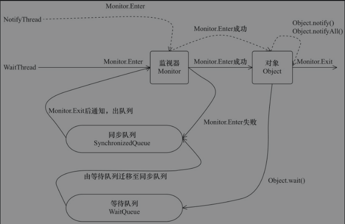

<center>java并发编程艺术-wait_notify</center>

### 4.3.3 等待/通知的经典范式

**等待方：**

步骤：

- 获取对象的锁
- 如果条件不满足，调用wait，被通知后继续检查条件
- 条件满足执行逻辑

伪码：

```java
synchronized (对象) {
    while(true){
        if (不满足条件) {
            wait();
        }
    }
    // 逻辑
}
```

**通知方：**

步骤：

- 获取对象的锁
- 改变条件
- 通知所有等待在该对象的线程

伪码：

```java
synchronized (对象) {
    flag = true;
    对象.notifyAll();
}
```

### 4.3.4 管道输入输出流

和普通流区别，用于线程之间数据传输，传输媒介是内存

实现类：

- PipedOutputStream、PipedInputStream： 面向字节
- PipedReader、PipedWriter：面向字符

一个示例，来自[https://www.yiibai.com/java_io/java_io_pipe.html](https://www.yiibai.com/java_io/java_io_pipe.html)

```java
public class Main {
  public static void main(String[] args) throws Exception {
    PipedInputStream pis = new PipedInputStream();
    PipedOutputStream pos = new PipedOutputStream();
    pos.connect(pis);   // 这里是一定要连接的

    Runnable producer = () -> produceData(pos);
    Runnable consumer = () -> consumeData(pis);
    new Thread(producer).start();
    new Thread(consumer).start();
  }

  public static void produceData(PipedOutputStream pos) {
    try {
      for (int i = 1; i <= 50; i++) {
        pos.write((byte) i);
        pos.flush();
        System.out.println("Writing: " + i);
        Thread.sleep(500);
      }
      pos.close();
    } catch (Exception e) {
      e.printStackTrace();
    }
  }
  public static void consumeData(PipedInputStream pis) {
    try {
      int num = -1;
      while ((num = pis.read()) != -1) {
        System.out.println("Reading: " + num);
      }
      pis.close();
    } catch (Exception e) {
      e.printStackTrace();
    }

  }
}

```

### 4.3.5 join

如果一个线程A执行了thread.join()语句，其含义是：当前线程A等待thread线程终止之后才从thread.join()返回。

另有超时的方法 join(long), join(long,int)


### 4.3.6 ThreadLocal

ThreadLocal，是一个以ThreadLocal对象为键、任意对象为值的存储结构。这个结构被附带在线程上，也就是说一个线程可以根据一个ThreadLocal对象查询到绑定在这个线程上的一个值.


 ## 4.4 线程应用实例

 ### 4.4.1 等待超时模式

 类似上面的等待通知模式，调用wait(long) 加入超时的控制，防止一致被阻塞

 ### 4.4.2 一个简单的数据库连接池示例

实质就是4.4.1的一个实际的例子

测试时使用了CountDownLatch这个类，[参考](https://www.cnblogs.com/dolphin0520/p/3920397.html)

### 4.4.3 线程池技术及其示例

- 线程的创建会消耗资源
- 考虑将线程池化，用的时候取，用完归还，此之为线程池

### 4.4.5 一个基于线程池技术的简单Web服务器

这是一个运用线程池技术的案例，里边不仅涉及到线程池技术，也涉及socket编程。案例不难，但很好，这里直接贴出来

```java
public class SimpleHttpServer {
    // 处理HttpRequest的线程池
    static ThreadPool<HttpRequestHandler> threadPool = new DefaultThreadPool<HttpRequestHandler>(11);
    // SimpleHttpServer的根路径
    static String basePath;
    static ServerSocket                   serverSocket;
    // 服务监听端口
    static int                            port       = 8080;
 
    public static void setPort(int port) {
        if (port > 0) {
            SimpleHttpServer.port = port;
        }
    }
 
    public static void setBasePath(String basePath) {
        if (basePath != null && new File(basePath).exists() && new File(basePath).isDirectory()) {
            SimpleHttpServer.basePath = basePath;
        }
    }
 
    // 启动SimpleHttpServer
    public static void start() throws Exception {
        serverSocket = new ServerSocket(port);
        Socket socket = null;
        while ((socket = serverSocket.accept()) != null) {
            // 接收一个客户端Socket，生成一个HttpRequestHandler，放入线程池执行
            threadPool.execute(new HttpRequestHandler(socket));
        }
        serverSocket.close();
    }
 
    static class HttpRequestHandler implements Runnable {
 
        private Socket socket;
 
        public HttpRequestHandler(Socket socket) {
            this.socket = socket;
        }
 
        @Override
        public void run() {
            String line = null;
            BufferedReader br = null;
            BufferedReader reader = null;
            PrintWriter out = null;
            InputStream in = null;
            try {
                reader = new BufferedReader(new InputStreamReader(socket.getInputStream()));
                String header = reader.readLine();
                // 由相对路径计算出绝对路径
                String filePath = basePath + header.split(" ")[1];
                out = new PrintWriter(socket.getOutputStream());
                // 如果请求资源的后缀为jpg或者ico，则读取资源并输出
                if (filePath.endsWith("jpg") || filePath.endsWith("ico")) {
                    in = new FileInputStream(filePath);
                    ByteArrayOutputStream baos = new ByteArrayOutputStream();
                    int i = 0;
                    while ((i = in.read()) != -1) {
                        baos.write(i);
                    }
 
                    byte[] array = baos.toByteArray();
                    out.println("HTTP/1.1 200 OK");
                    out.println("Content-Type: image/jpeg");
                    out.println("Content-Length: " + array.length);
                    out.println("");
                    socket.getOutputStream().write(array, 0, array.length);
                } else {
                    br = new BufferedReader(new InputStreamReader(new FileInputStream(filePath)));
                    out = new PrintWriter(socket.getOutputStream());
                    out.println("HTTP/1.1 200 OK");
                    out.println("Content-Type: text/html; charset=UTF-8");
                    out.println("");
                    while ((line = br.readLine()) != null) {
                        out.println(line);
                    }
                }
                out.flush();
            } catch (Exception ex) {
                out.println("HTTP/1.1 500");
                out.println("");
                out.flush();
            } finally {
                close(br, in, reader, out, socket);
            }
        }
    }
 
    // 关闭流或者Socket
    private static void close(Closeable... closeables) {
        if (closeables != null) {
            for (Closeable closeable : closeables) {
                try {
                    closeable.close();
                } catch (Exception ex) {
                    // 忽略
                }
            }
        }
    }
	
    public static void main(String[] args) {  
	basePath = "C:/Users/lenovo/Desktop";  
	SimpleHttpServer.setBasePath(basePath);  
	try{  
		start();  
	}catch(Exception e){  
		e.printStackTrace();  
	}  
    }
}

————————————————
版权声明：本文为CSDN博主「样young」的原创文章，遵循CC 4.0 BY-SA版权协议，转载请附上原文出处链接及本声明。
原文链接：https://blog.csdn.net/jisuanjiguoba/java/article/details/80548045
```


# 第5章 java中的锁

## 5.1 Lock接口

锁是用来控制多个线程访问共享资源的方式，一般来说，一个锁能够防止多个线程同时访问共享资源（但是有些锁可以允许多个线程并发的访问共享资源，比如读写锁）


锁和synchronized都是线程同步的工具， 主要区别如下：

1. synchronized是隐式获取释放锁，比较简单和固定，Lock是需要手动获取锁和释放，比较灵活
2. Lock可以尝试非阻塞获取锁、能被中断的获取锁、能够带超时的获取锁， synchronized不能做到

Lock的API:

|方法|说明|
|----|---|
|void lock()|获取锁。调用方法会获取锁，直到锁获取后返回|
|void lockInterruptibly() throws InterruptedException|可中断获取锁，在获取锁的过程中可以被中断，被中断后抛出异常返回|
|boolean tryLock()|尝试非阻塞的获取锁，立即返回，拿到锁返回true，否则false|
|boolean tryLock(long time, TimeUnit unit) throws InterruptedException|超时的获取锁<br/>返回的情况<br/>1. 在超时时间内获取到了锁，返回true<br/>2. 被中断了，抛出异常返回<br/>3. 超时时间到，返回false|
|void unlock()|释放锁|
|Condition newCondition()|获取等待通知组件，只有拿到了锁，才能拿到这个对象，调用wait()方法，调用后释放锁|


**不要将获取锁的过程写在try块中，因为如果在获取锁（自定义锁的实现）时发生了异常，异常抛出的同时，也会导致锁无故释放。**


## 5.2 队列同步器AbstractQueuedSynchronizer（AQS)

- 用来构建锁或者其他同步组件的基础框架
- 同步器是实现锁（也可以是任意同步组件）的关键，在锁的实现中聚合同步器，利用同步器实现锁的语义。


### 5.2.1 队列同步器的接口与示例

同步器访问和修改状态的三个方法

- getState()
- setState()
- compareAndSetState(): CAS操作保证原子性

可重写方法：

- protected boolean tryAcquire(int arg): 独占式获取同步状态，在此方法中需要查询当前状态并判断是否符合预期，然后CAS设置同步状态
- protected boolean tryRelease(int arg)： 独占式释放同步状态，  等待获取同步状态的线程有机会拿到同步状态
- protected int tryAcquireShared(int arg)：共享式获取同步状态，返回>=0表示获取成功，否则表示获取失败
- protected boolean tryReleaseShared(int arg)：共享式释放同步状态
- protected boolean isHeldExclusively()：当前同步器是否在独占模式下被线程占用

AQS提供的模板方法：

- public final void acquire(int arg)： 独占式获取同步状态，获取成功则返回，否则进入同步队列等待，会调用重写的tryAcquire(int arg)
- public final void acquireInterruptibly(int arg)：独占是获取同步状态，但是能响应中断，被中断抛异常
- public final boolean tryAcquireNanos(int arg, long nanosTimeout)：独占是获取同步状态，能响应中断，且有超时，超时返回false
- public final void acquireShared(int arg)：共享式获取同步状态，没获取到则进入同步队列，同一时刻可以有多个线程获取到同步状态
- public final void acquireSharedInterruptibly(int arg)：可以被中断
- public final boolean tryAcquireSharedNanos(int arg, long nanosTimeout)：带超时，且能被中断
- public final boolean release(int arg)：独占式释放同步状态，释放后会将同步队列第一个节点唤醒
- public final boolean releaseShared(int arg): 共享式释放同步状态；
- public final Collection<Thread> getQueuedThreads(): 获取同步队列里的线程


一个独占锁的示例：

```java
public class Mutex implements Lock {
    private static class Sync extends AbstractQueuedSynchronizer {

        private static final long serialVersionUID = -9167644904979247261L;

        protected Sync() {
            super();
        }

        @Override
        protected boolean tryAcquire(int arg) {
            if (compareAndSetState(0, 1)) {
                setExclusiveOwnerThread(Thread.currentThread());
                return true;
            }
            return false;
        }

        @Override
        protected boolean tryRelease(int arg) {
            if (getState() == 0) {
                throw new IllegalMonitorStateException();
            }
            setExclusiveOwnerThread(null);
            setState(0);
            return true;
        }

        @Override
        protected int tryAcquireShared(int arg) {
            return super.tryAcquireShared(arg);
        }

        @Override
        protected boolean tryReleaseShared(int arg) {
            return super.tryReleaseShared(arg);
        }

        @Override
        protected boolean isHeldExclusively() {
            return getState() == 1;
        }

        @Override
        public String toString() {
            return super.toString();
        }

        Condition newCondition() {
            return new ConditionObject();
        }
    }

    private final Sync sync = new Sync();


    @Override
    public void lock() {
        sync.acquire(1);
    }

    @Override
    public void lockInterruptibly() throws InterruptedException {
        sync.acquireInterruptibly(1);
    }

    @Override
    public boolean tryLock() {
        return sync.tryAcquire(1);
    }

    @Override
    public boolean tryLock(long time, TimeUnit unit) throws InterruptedException {
        return sync.tryAcquireNanos(1, unit.toNanos(time));
    }

    @Override
    public void unlock() {
        sync.tryRelease(1);
    }

    @Override
    public Condition newCondition() {
        return sync.newCondition();
    }
}

```

### 5.2.2 AQS实现分析

#### 同步队列

AQS依赖内部的同步队列来完成同步状态的管理，当前线程获取同步状态失败时，AQS会将当前线程以及等待状态等信息构造成为一个节点（Node）并将其加入同步队列，同时会阻塞当前线程，当同步状态释放时，会把首节点中的线程唤醒，使其再次尝试获取同步状态。

- 同步队列的节点

**int waitStatus**

CANCELLED=1：同步队列中的线程等待超时或被中断，需要取消等待，到达这个状态后将不会再变化了

SIGNAL=-1：后继节点处于等待状态，当前节点释放了同步状态或者超时或者被中断会通知后继节点

CONDITION = -2：节点在等待队列中，等待在Condition上，其他线程调用了Condition的signal后，该节点从等待队列转移到同步队列，加入到对同步状态的获取中

PROPAGATE = -3：表示下一次共享是同步状态获取将会无限制传播下去

INITIAL=0:初始状态

**Node prev**

前驱节点

**Node next**

后继节点

**Node nextWaiter**

等待队列中的后继节点。如果当前节点是共享节点，那么该字段值未SHARED常量

**Thread thread**

获取到同步状态的线程

- 同步队列的操作

同步队列是双向队列，有一个头节点和尾节点，入队主要是尾节点引用变化，出队头节点引用变化

- 入队：必须要保证线程安全，因此同步器提供了一个基于CAS的设置尾节点的方法：compareAndSetTail(Node expect, Node update)
- 出队：设置首节点是通过获取同步状态成功的线程来完成的，由于只有一个线程能够成功获取到同步状态，因此设置头节点的方法并不需要使用CAS来保证


#### 独占式同步状态的获取与释放

- 获取

通过调用同步器的acquire(int arg)方法可以获取同步状态，该方法对中断不敏感，也就是由于线程获取同步状态失败后进入同步队列中，后续对线程进行中断操作时，线程不会从同步队列中移出。

具体步骤：

调用自定义同步器实现的tryAcquire(intarg)方法，若失败，创建同步节点，加入同步队列

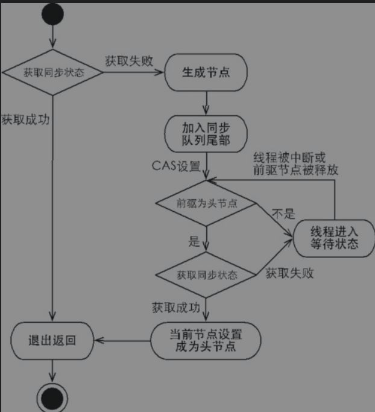

- 释放

通过调用同步器的release(int arg)方法可以释放同步状态，该方法在释放了同步状态之后，会唤醒其后继节点

#### 共享式同步状态获取与释放

共享式获取与独占式获取最主要的区别在于同一时刻能否有多个线程同时获取到同步状态。

通过调用同步器的acquireShared(int arg)方法可以共享式地获取同步状态


通过调用releaseShared(intarg)方法可以释放同步状态，它和独占式主要区别在于tryReleaseShared(int arg)方法必须确保同步状态（或者资源数）线程安全释放，一般是通过循环和CAS来保证的，因为释放同步状态的操作会同时来自多个线程。

#### 独占式超时获取同步状态
通过调用同步器的doAcquireNanos(int arg, long nanosTimeout)方法可以超时获取同步状态


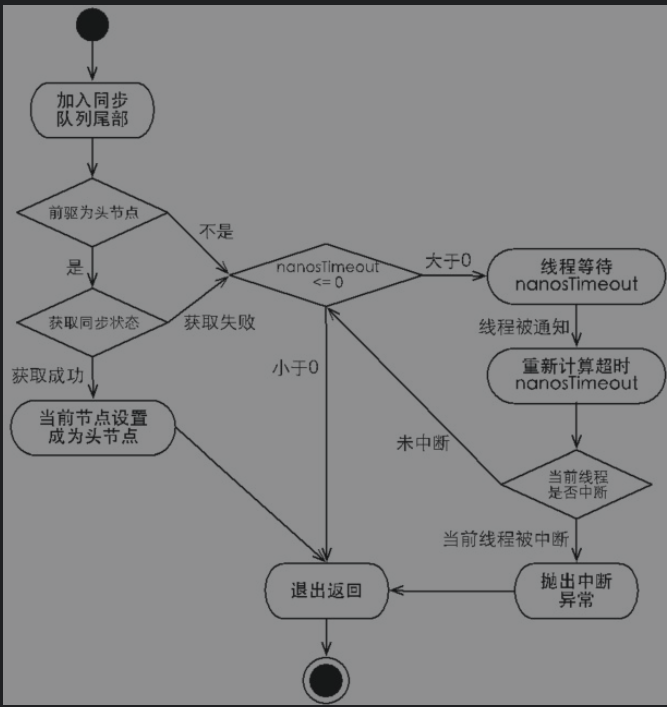


#### 自定义同步组件——TwinsLock

这是一个例子

设计一个同步工具：该工具在同一时刻，只允许至多两个线程同时访问，超过两个线程的访问将被阻塞，我们将这个同步工具命名为TwinsLock。


## 5.3 重入锁（ReentrantLock）

### 定义

就是支持重进入的锁，它表示该锁能够支持一个线程对资源的重复加锁。除此之外，该锁的还支持获取锁时的公平和非公平性选择。

**synchronized是可重入的**

### 重新进入的实现原理

- 1）线程再次获取锁。锁需要去识别获取锁的线程是否为当前占据锁的线程，如果是，则再次成功获取。
- 2）锁的最终释放。线程重复n次获取了锁，随后在第n次释放该锁后，其他线程能够获取到该锁。锁的最终释放要求锁对于获取进行计数自增，计数表示当前锁被重复获取的次数，而锁被释放时，计数自减，当计数等于0时表示锁已经成功释放。

### 公平锁与非公平锁的区别

公平锁获取锁的方法与nonfairTryAcquire(int acquires)比较，唯一不同的位置为判断条件多了hasQueuedPredecessors()方法，即加入了同步队列中当前节点是否有前驱节点的判断，如果该方法返回true，则表示有线程比当前线程更早地请求获取锁，因此需要等待前驱线程获取并释放锁之后才能继续获取锁。

非公平性锁可能造成线程“饥饿”，但极少的线程切换，保证了其更大的吞吐量。

公平锁会带来更多的线程切换，因此在高并发下性能会差一些。

## 5.4 读写锁（ReentrantReadWriteLock）

- 读写锁在同一时刻允许多个线程访问
- 当一个写线程访问时，所有其他线程阻塞
- 当一个读线程访问时，其他读线程不会被阻塞
- 读写锁维护了一对锁，一个读锁和一个写锁，通过分离读锁和写锁，使得并发性相比一般的排他锁有了很大提升。
- 在读多于写的情况下，读写锁能够提供比排它锁更好的并发性和吞吐量

特性：

- 支持公平锁与非公平锁
- 可重入
- 支持锁降级：遵循获取写锁、获取读锁再释放写锁的次序，写锁能够降级为读锁

核心API：

- ReentrantReadWriteLock.ReadLock  readLock()： 获取读锁
- ReentrantReadWriteLock.WriteLock writeLock()： 获取写锁
- int getReadLockCount()：返回当前读锁被获取到的次数，与线程数无关，同一个线程获取n次 返回n
- int getReadHoldCount()：返回当前线程获取读锁的次数
- boolean isWriteLocked()：判断读锁是否被获取了
- int getWriteHoldCount()：获取当前写锁被获取的次数


### 5.4.1 读写锁的实现分析


- 读写状态设计

仍然是使用AQS的同步状态，同步状态时32位整形，我们需要用它表示读线程的状态和写线程的状态，因此需要拆分使用，高16位表示写状态、低16位标识读状态。

假设当前同步状态值为S，写状态等于S&0x0000FFFF，读状态等于S>>>16（无符号补0右移16位）。当写状态增加1时，等于S+1，当读状态增加1时，等于S+(1<<16)，也就是S+0x00010000。


- 写锁的获取与释放

写锁是一个支持重进入的排它锁。如果当前线程已经获取了写锁，则增加写状态。如果当前线程在获取写锁时，读锁已经被获取（读状态不为0）或者该线程不是已经获取写锁的线程，则当前线程进入等待状态。

写锁的释放与ReentrantLock的释放过程基本类似，每次释放均减少写状态，当写状态为0时表示写锁已被释放，从而等待的读写线程能够继续访问读写锁，同时前次写线程的修改对后续读写线程可见。

- 读锁的获取与释放

读锁是一个支持重进入的共享锁，它能够被多个线程同时获取，在没有其他写线程访问（或者写状态为0）时，读锁总会被成功地获取，而所做的也只是（线程安全的）增加读状态。如果当前线程已经获取了读锁，则增加读状态。如果当前线程在获取读锁时，写锁已被其他线程获取，则进入等待状态。


- 锁降级

锁降级指的是写锁降级成为读锁。锁降级是指把持住（当前拥有的）写锁，再获取到读锁，随后释放（先前拥有的）写锁的过程。

锁降级的例子

xxxx

为什么要有锁降级

主要是为了保证数据的可见性，如果当前线程不获取读锁而是直接释放写锁，假设此刻另一个线程（记作线程T）获取了写锁并修改了数据，那么当前线程无法感知线程T的数据更新。如果当前线程获取读锁，即遵循锁降级的步骤，则线程T将会被阻塞，直到当前线程使用数据并释放读锁之后，线程T才能获取写锁进行数据更新。

RentrantReadWriteLock不支持锁升级（把持读锁、获取写锁，最后释放读锁的过程）。目的也是保证数据可见性，如果读锁已被多个线程获取，其中任意线程成功获取了写锁并更新了数据，则其更新对其他获取到读锁的线程是不可见的。


## 5.5 LockSupport工具

当需要阻塞或唤醒一个线程的时候，都会使用LockSupport工具类来完成相应工作。LockSupport定义了一组的公共静态方法，这些方法提供了最基本的线程阻塞和唤醒功能，而LockSupport也成为构建同步组件的基础工具。

- static void park(): 阻塞当前线程，调用static void unpark(Thread thread)，或者当前线程被中断才返回
- static void parkNanos(long nanos)： 加上了超时的支持
- static void parkUntil(long deadline)：阻塞当前线程直到deadline
- static void unpark(Thread thread): 唤醒处于阻塞状态的线程thread
- static void park(Object blocker)
- static void parkNanos(Object blocker, long nanos)
- static void parkUntil(Object blocker, long deadline)

*brocker可以标识阻塞对象*


## 5.6 Condition接口

- 任意一个Java对象，都拥有一组监视器方法（定义在java.lang.Object上），主要包括wait()、wait(long timeout)、notify()以及notifyAll()方法，这些方法与synchronized同步关键字配合，可以实现等待/通知模式

- Condition接口也提供了类似Object的监视器方法，与Lock配合可以实现等待/通知模式


<center>Object的监视器方法和Condition对比</center>


### 5.6.1 Condition接口与示例


Condition定义了等待/通知两种类型的方法，当前线程调用这些方法时，需要提前获取到Condition对象关联的锁

一般都会将Condition对象作为成员变量。当调用await()方法后，当前线程会释放锁并在此等待，而其他线程调用Condition对象的signal()方法，通知当前线程后，当前线程才从await()方法返回，并且在返回前已经获取了锁。

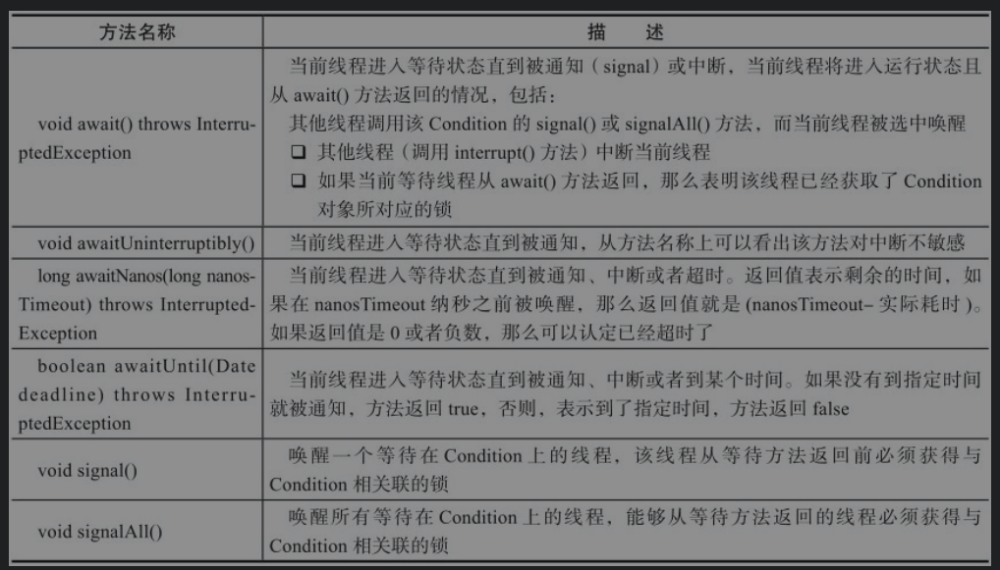

<center>Condition的一些方法</center>


一个实现有界队列的例子

思考思考
cxxxxxx

### 5.6.2 Condition的实现原理

ConditionObject是同步器AbstractQueuedSynchronizer的内部类，因为Condition的操作需要获取相关联的锁，所以作为同步器的内部类也较为合理。每个Condition对象都包含着一个队列（以下称为等待队列），该队列是Condition对象实现等待/通知功能的关键。

**等待队列**

- 是一个FIFO队列
- 对列中每个节点包含了在Condition对象上等待的队列的引用
- 如果一个线程调用了Condition.await()，那么该线程将释放锁，构建节点进入等待队列等待
- 这个节点和同步队列的节点是一样的
- 入队和出队是不用做CAS的，因为线程获取了锁

**等待**


当调用await()方法时，相当于同步队列的首节点（获取了锁的节点）移动到Condition的等待队列中。

然后释放同步状态，唤醒同步队列中的后继节点，然后当前线程会进入等待状态。

**通知**

调用Condition的signal()方法，将会唤醒在等待队列中等待时间最长的节点（首节点），在唤醒节点之前，会将节点移到同步队列中。


# 第6章 Java并发容器和框架

## 6.1 ConcurrentHashMap的实现原理与使用

ConcurrentHashMap是线程安全且高效的HashMap

### 6.1.1 为什么要使用ConcurrentHashMap

- HashMap是线程不安全的

因为多线程会导致HashMap的Entry链表形成环形数据结构，一旦形成环形数据结构，Entry的next节点永远不为空，就会产生死循环获取Entry。

- HashTable效率低下

基于synchronized来保证线程安全，在线程竞争激烈的情况下HashTable的效率非常低下。如线程1使用put进行元素添加，线程2不但不能使用put方法添加元素，也不能使用get方法来获取元素，所以竞争越激烈效率越低。

- ConcurrentHashMap的锁分段技术可有效提升并发访问率

首先将数据分成一段一段地存储，然后给每一段数据配一把锁，当一个线程占用锁访问其中一个段数据的时候，其他段的数据也能被其他线程访问。

### 6.1.2 ConcurrentHashMap的结构

- ConcurrentHashMap是由Segment数组结构和HashEntry数组结构组成
- Segment是一种可重入锁
- HashEntry用于存储键值对数据
- 一个ConcurrentHashMap里包含一个Segment数组。Segment的结构和HashMap类似，是一种数组和链表结构。
- 一个Segment里包含一个HashEntry数组
- 每个HashEntry是一个链表结构的元素
- 每个Segment守护着一个HashEntry数组里的元素
- 当对HashEntry数组的数据进行修改时，必须首先获得与它对应的Segment锁

### 6.1.3 ConcurrentHashMap的初始化

- 初始化segments数组

初始化过程主要就是

1. 计算数组长度ssize，segments数组的长度ssize是通过concurrencyLevel计算得出的。为了能通过按位与的散列算法来定位segments数组的索引，必须保证segments数组的长度是2的N次方（power-of-two size），所以必须计算出一个大于或等于concurrencyLevel的最小的2的N次方值来作为segments数组的长度。concurrencyLevel的最大值是65535，所以segments数组的长度最大为65536，对应的二进制是16位。

- 初始化segmentShift和segmentMask

1. 计算段偏移量segmentShift，sshift等于ssize从1向左移位的次数，在默认情况下concurrencyLevel等于16，1需要向左移位移动4次，所以sshift等于4。segmentShift用于定位参与散列运算的位数，segmentShift等于32减sshift，所以等于28，这里之所以用32是因为ConcurrentHashMap里的hash()方法输出的最大数是32位的
2. 计算段掩码segmentMask，segmentMask是散列运算的掩码，等于ssize减1，即15，掩码的二进制各个位的值都是1。因为ssize的最大长度是65536，所以segmentShift最大值是16，segmentMask最大值是65535，对应的二进制是16位，每个位都是1。

- 初始化每个segment

就是为数组中的每个元素赋值

- 定位Segment

既然ConcurrentHashMap使用分段锁Segment来保护不同段的数据，那么在插入和获取元素的时候，必须先通过散列算法定位到Segment。可以看到ConcurrentHashMap会首先使用Wang/Jenkins hash的变种算法对元素的hashCode进行一次再散列。进行再散列的目的是减少散列冲突


### 6.1.5 ConcurrentHashMap的操作

- get

先经过一次再散列，然后使用这个散列值通过散列运算定位到Segment，再通过散列算法定位到元素

get操作的高效之处在于整个get过程不需要加锁，除非读到的值是空才会加锁重读

- put

由于put方法里需要对共享变量进行写入操作，所以为了线程安全，在操作共享变量时必须加锁。put方法首先定位到Segment，然后在Segment里进行插入操作。插入操作需要经历两个步骤，第一步判断是否需要对Segment里的HashEntry数组进行扩容，第二步定位添加元素的位置，然后将其放在HashEntry数组里。


- size

ConcurrentHashMap的做法是先尝试2次通过不锁住Segment的方式来统计各个Segment大小，如果统计的过程中，容器的count发生了变化，则再采用加锁的方式来统计所有Segment的大小。


## 6.2 ConcurrentLinkedQueue

线程安全的队列实现方式

1. 使用阻塞算法：入队和出队加锁，同一把锁或者不同的锁
2. 使用非阻塞算法：CAS

ConcurrentLinkedQueue是一个基于链接节点的无界线程安全队列，采用了“wait-free”算法（即CAS算法）来实现


### 6.2.1 入队

- 入队过程：

第一是定位出尾节点；第二是使用CAS算法将入队节点设置成尾节点的next节点，如不成功则重试。

- 定位尾节点

tail节点并不总是尾节点，所以每次入队都必须先通过tail节点来找到尾节点。尾节点可能是tail节点，也可能是tail节点的next节点

- 设置入队节点为尾节点

p.casNext（null，n）方法用于将入队节点设置为当前队列尾节点的next节点，如果p是null，表示p是当前队列的尾节点，如果不为null，表示有其他线程更新了尾节点，则需要重新获取当前队列的尾节点。

- HOPS的设计意图

使用hops变量来控制并减少tail节点的更新频率，并不是每次节点入队后都将tail节点更新成尾节点，而是当tail节点和尾节点的距离大于等于常量HOPS的值（默认等于1）时才更新tail节点，tail和尾节点的距离越长，使用CAS更新tail节点的次数就会越少，但是距离越长带来的负面效果就是每次入队时定位尾节点的时间就越长，因为循环体需要多循环一次来定位出尾节点，但是这样仍然能提高入队的效率，因为从本质上来看它通过增加对volatile变量的读操作来减少对volatile变量的写操作，而对volatile变量的写操作开销要远远大于读操作，所以入队效率会有所提升。


### 6.2.2 出队

出队列的就是从队列里返回一个节点元素，并清空该节点对元素的引用

并不是每次出队时都更新head节点，当head节点里有元素时，直接弹出head节点里的元素，而不会更新head节点。只有当head节点里没有元素时，出队操作才会更新head节点。这种做法也是通过hops变量来减少使用CAS更新head节点的消耗，从而提高出队效率。


### 6.3 java中的阻塞队列

#### 阻塞队列的概念

阻塞队列（BlockingQueue）是一个支持两个附加操作的队列。这两个附加的操作支持阻塞的插入和移除方法。


- 支持阻塞的插入方法：意思是当队列满时，队列会阻塞插入元素的线程，直到队列不满。
- 支持阻塞的移除方法：意思是在队列为空时，获取元素的线程会等待队列变为非空。

阻塞队列适用于生产者消费者的模式

当阻塞队列不可用时，提供了四种处理方式

|方法|抛出异常|返回特殊值|一直阻塞|超时退出|
|----|-------|----------|------|---------|
|插入|add(e)|offer(e)|put(e)|offer(e, time, unit)|
|移除|remove()|poll()|take()|poll(time,unit)|
|检查|element()|peek()|不可用|不可用|


*如果是无界阻塞队列，队列不可能会出现满的情况，所以使用put或offer方法永远不会被阻塞，而且使用offer方法时，该方法永远返回true。*


### 6.3.2 java中的阻塞队列

- ArrayBlockingQueue：一个由数组结构组成的有界阻塞队列。

此队列按照先进先出（FIFO）的原则对元素进行排序。

默认时非公平的

公平的时适用ReentrantLock实现的，会影响吞吐量


- LinkedBlockingQueue：一个由链表结构组成的有界阻塞队列。

此队列的默认和最大长度为Integer.MAX_VALUE。此队列按照先进先出的原则对元素进行排序。

- PriorityBlockingQueue：一个支持优先级排序的无界阻塞队列。

默认情况下元素采取自然顺序升序排列。也可以自定义类实现compareTo()方法来指定元素排序规则，或者初始化PriorityBlockingQueue时，指定构造参数Comparator来对元素进行排序

- DelayQueue：一个使用优先级队列实现的无界阻塞队列。

队列使用PriorityQueue来实现。队列中的元素必须实现Delayed接口，在创建元素时可以指定多久才能从队列中获取当前元素。只有在延迟期满时才能从队列中提取元素。

**适用场景**

1. 缓存系统的设计
2. 定时任务调度

**适用**

如何实现Delayed接口

第一步：在对象创建的时候，初始化基本数据。使用time记录当前对象延迟到什么时候可以使用，使用sequenceNumber来标识元素在队列中的先后顺序

第二步：实现getDelay方法，该方法返回当前元素还需要延时多长时间，单位是纳秒

第三步：实现compareTo方法来指定元素的顺序。

如何实现延时阻塞队列

延时阻塞队列的实现很简单，当消费者从队列里获取元素时，如果元素没有达到延时时间，就阻塞当前线程。


- SynchronousQueue：一个不存储元素的阻塞队列。

每一个put操作必须等待一个take操作，否则不能继续添加元素。

默认非公平

队列本身并不存储任何元素，非常适合传递性场景


- LinkedTransferQueue：一个由链表结构组成的无界阻塞队列。

相对于其他阻塞队列，LinkedTransferQueue多了tryTransfer和transfer方法。

transfer方法：

如果当前有消费者正在等待接收元素（消费者使用take()方法或带时间限制的poll()方法时），transfer方法可以把生产者传入的元素立刻transfer（传输）给消费者。如果没有消费者在等待接收元素，transfer方法会将元素存放在队列的tail节点，并等到该元素被消费者消费了才返回。

tryTransfer方法：

tryTransfer方法是用来试探生产者传入的元素是否能直接传给消费者。如果没有消费者等待接收元素，则返回false。

和transfer方法的区别是tryTransfer方法无论消费者是否接收，方法立即返回，而transfer方法是必须等到消费者消费了才返回。

tryTransfer（E e，long timeout，TimeUnit unit）方法：

和transfer方法类似，但是多了超时限制，超时了还没被消费也会返回


- LinkedBlockingDeque：一个由链表结构组成的双向阻塞队列。

双向队列因为多了一个操作队列的入口，在多线程同时入队时，也就减少了一半的竞争。相比其他的阻塞队列，LinkedBlockingDeque多了addFirst、addLast、offerFirst、offerLast、peekFirst和peekLast等方法

双向阻塞队列可以运用在“工作窃取”模式中。

### 6.3.3 双向队列实现原理

使用通知模式实现。所谓通知模式，就是当生产者往满的队列里添加元素时会阻塞住生产者，当消费者消费了一个队列中的元素后，会通知生产者当前队列可用。通过查看JDK源码发现ArrayBlockingQueue使用了Condition来实现

## 6.4 Fork/Join框架

### 6.4.1 定义

Fork/Join框架是Java 7提供的一个用于并行执行任务的框架，是一个把大任务分割成若干个小任务，最终汇总每个小任务结果后得到大任务结果的框架。

### 6.4.2 工作窃取算法

工作窃取（work-stealing）算法是指某个线程从其他队列里窃取任务来执行

为了减少窃取任务线程和被窃取任务线程之间的竞争，通常会使用双端队列，被窃取任务线程永远从双端队列的头部拿任务执行，而窃取任务的线程永远从双端队列的尾部拿任务执行。

- 工作窃取算法的优点：充分利用线程进行并行计算，减少了线程间的竞争。
- 工作窃取算法的缺点：在某些情况下还是存在竞争，比如双端队列里只有一个任务时。并且该算法会消耗了更多的系统资源，比如创建多个线程和多个双端队列。


### 6.4.3 Fork/Join框架的设计

- 分割任务

需要有一个fork类来把大任务分割成子任务，有可能子任务还是很大，所以还需要不停地分割，直到分割出的子任务足够小。

通过ForkJoinTask类实现

要使用ForkJoin框架，必须首先创建一个ForkJoin任务。它提供在任务中执行fork()和join()操作的机制。通常情况下，我们不需要直接继承ForkJoinTask类，只需要继承它的子类，Fork/Join框架提供了以下两个子类。

RecursiveAction：用于没有返回结果的任务。

RecursiveTask：用于有返回结果的任务。


- 执行任务，合并结果

ForkJoinPool：ForkJoinTask需要通过ForkJoinPool来执行。

任务分割出的子任务会添加到当前工作线程所维护的双端队列中，进入队列的头部。当一个工作线程的队列里暂时没有任务时，它会随机从其他工作线程的队列的尾部获取一个任务。

### 6.4.4 使用示例

使用的例子balabalxxx....

ForkJoinTask与一般任务的主要区别在于它需要实现compute方法，在这个方法里，首先需要判断任务是否足够小，如果足够小就直接执行任务。如果不足够小，就必须分割成两个子任务，每个子任务在调用fork方法时，又会进入compute方法，看看当前子任务是否需要继续分割成子任务，如果不需要继续分割，则执行当前子任务并返回结果。使用join方法会等待子任务执行完并得到其结果。


### 6.4.5 Fork/Join框架的异常处理

ForkJoinTask在执行的时候可能会抛出异常，但是我们没办法在主线程里直接捕获异常，所以ForkJoinTask提供了isCompletedAbnormally()方法来检查任务是否已经抛出异常或已经被取消了，并且可以通过ForkJoinTask的getException方法获取异常。使用如下代码。

### 6.4.6 Fork/Join框架的实现原理


ForkJoinPool由ForkJoinTask数组和ForkJoinWorkerThread数组组成，ForkJoinTask数组负责将存放程序提交给ForkJoinPool的任务，而ForkJoinWorkerThread数组负责执行这些任务。


# 第7章 Java中的13个原子操作类

为了实现原子操作，jdk1.5开始提供了一些原子操作类,位于java.util.concurrent.atomic包，Atomic包里的类基本都是使用Unsafe实现的包装类.

## 7.1 原子更新基本类型类

- AtomicBoolean：原子更新布尔类型。
- AtomicInteger：原子更新整型。
- AtomicLong：原子更新长整型。

方法基本类似，以AtomicInteger为例

### 核心API

- int addAndGet(int delta)： +delta并返回
- boolean compareAndSet(int expect, int update)：如果原来的值==expect那么更新为update, 返回true，否则返回false。
- int getAndIncrement()：先获取再加1
- void lazySet(int newValue)：最终会设置成newValue，使用lazySet设置值后，可能导致其他线程在之后的一小段时间内还是可以读到旧的值。
- int getAndSet(int newValue)：设置为newValue的值，并返回旧值。
- int get()：获取当前的值

### 核心原理

主要是使用compareAndSet(int expect, int update)，CAS，在旧值==expect时更新成功，否则失败，失败就自旋

而compareAndSet是调用了Unsafe里边的方法  native boolean compareAndSwapInt(Object var1, long var2, int var4, int var5)

## 原子更新数组

- AtomicIntegerArray：原子更新整型数组里的元素。
- AtomicLongArray：原子更新长整型数组里的元素。
- AtomicReferenceArray：原子更新引用类型数组里的元素。
- AtomicIntegerArray类主要是提供原子的方式更新数组里的整型。


这些东西方法类似，以AtomicIntergerArray为例

### 核心API

- int addAndGet(int i, int delta)： i位置+delta
- boolean compareAndSet(int i, int expect, int update): i位置如果旧值为expect，则更新
- int get(int i)：获取i位置的值

采用构造方法传进去的数据会被拷贝一份，所以互不影响


## 7.3 原子更新引用类型

如果要原子更新多个变量，就需要使用这个原子更新引用类型提供的类

- AtomicReference：原子更新引用类型。
- AtomicReferenceFieldUpdater：原子更新引用类型里的字段。
- AtomicMarkableReference：原子更新带有标记位的引用类型。可以原子更新一个布尔类型的标记位和引用类型。构造方法是AtomicMarkableReference（V initialRef, boolean initialMark）。

用法差不多，以AtomicReference为例

### 核心API

- void set(V newValue)：set值
- void boolean compareAndSet(V expect, V update)：比较设置


## 7.4 原子更新字段类

如果需原子地更新某个类里的某个字段时，就需要使用原子更新字段类

- AtomicIntegerFieldUpdater：原子更新整型的字段的更新器。
- AtomicLongFieldUpdater：原子更新长整型字段的更新器。
- AtomicStampedReference：原子更新带有版本号的引用类型。该类将整数值与引用关联起来，可用于原子的更新数据和数据的版本号，可以解决使用CAS进行原子更新时可能出现的ABA问题。

- 第一步，因为原子更新字段类都是抽象类，每次使用的时候必须使用静态方法newUpdater()创建一个更新器，并且需要设置想要更新的类和属性。
- 第二步，更新类的字段（属性）必须使用public volatile修饰符。

核心api:

举一个例子

- int getAndIncrement(T obj)


# 第8章 Java中的并发工具类

- CountDownLatch、CyclicBarrier和Semaphore用于并发流程控制
- Exchanger用于在线程之间交换数据

## 8.1 等待多线程完成的CountDownLatch

CountDownLatch允许一个或多个线程等待其他线程完成操作。

join用于让当前执行线程等待join线程执行结束。其实现原理是不停检查join线程是否存活，如果join线程存活则让当前线程永远等待.直到join线程中止后，线程的this.notifyAll()方法会被调用。

```java
public class TestCountDownLatch implements Runnable {
    CountDownLatch countDownLatch;
    public TestCountDownLatch(CountDownLatch countDownLatch) {
        this.countDownLatch = countDownLatch;
    }
    @Override
    public void run() {
        System.out.println(Thread.currentThread().getName() + "执行完了");
        countDownLatch.countDown();
    }

    public static void main(String[] args) throws InterruptedException {
        int THREAD_COUNT = 3;
        CountDownLatch countDownLatch = new CountDownLatch(THREAD_COUNT);
        for (int i = 0; i < THREAD_COUNT; i++) {
            new Thread(new TestCountDownLatch(countDownLatch)).start();
        }
        countDownLatch.await();
        System.out.println("主线程继续执行");
    }
}
```


## 8.2 同步屏障CyclicBarrier

让一组线程到达一个屏障（也可以叫同步点）时被阻塞，直到最后一个线程到达屏障时，屏障才会开门，所有被屏障拦截的线程才会继续运行。

CyclicBarrier默认的构造方法是CyclicBarrier（int parties），其参数表示屏障拦截的线程数量，每个线程调用await方法告诉CyclicBarrier我已经到达了屏障，然后当前线程被阻塞。

一个demo

```java
public class TestCycliBarrier {
    public static void main(String[] args) throws BrokenBarrierException, InterruptedException {
        CyclicBarrier cyclicBarrier = new CyclicBarrier(2);

        new Thread(() -> {
            try {
                cyclicBarrier.await();
                System.out.println(Thread.currentThread().getName() + "执行了");
            } catch (Exception e) {
                e.printStackTrace();
            }
        }).start();

        cyclicBarrier.await();
        System.out.println(Thread.currentThread().getName() + "执行了");
    }
}

```

### 8.2.1 CyclicBarrier的应用场景

CyclicBarrier可以用于多线程计算数据，最后合并计算结果的场景。例如，用一个Excel保存了用户所有银行流水，每个Sheet保存一个账户近一年的每笔银行流水，现在需要统计用户的日均银行流水，先用多线程处理每个sheet里的银行流水，都执行完之后，得到每个sheet的日均银行流水，最后，再用barrierAction用这些线程的计算结果，计算出整个Excel的日均银行流水

这个例子可以练习一下

### 8.2.2 CyclicBarrier和CountDownLatch的区别

CountDownLatch的计数器只能使用一次，而CyclicBarrier的计数器可以使用reset()方法重置。所以CyclicBarrier能处理更为复杂的业务场景。例如，如果计算发生错误，可以重置计数器，并让线程重新执行一次。

CyclicBarrier还提供其他有用的方法，比如getNumberWaiting方法可以获得Cyclic-Barrier阻塞的线程数量。isBroken()方法用来了解阻塞的线程是否被中断。


## 8.3 控制并发线程数的Semaphore

Semaphore（信号量）是用来控制同时访问特定资源的线程数量，它通过协调各个线程，以保证合理的使用公共资源。

### 8.3.1 应用场景

Semaphore可以用于做流量控制，特别是公用资源有限的应用场景

Semaphore的构造方法Semaphore（int permits）接受一个整型的数字，表示可用的许可证数量。

Semaphore的用法也很简单，首先线程使用Semaphore的acquire()方法获取一个许可证，使用完之后调用release()方法归还许可证。还可以用tryAcquire()方法尝试获取许可证。

### 8.3.2 一些api

- intavailablePermits()：返回此信号量中当前可用的许可证数。
- intgetQueueLength()：返回正在等待获取许可证的线程数。
- booleanhasQueuedThreads()：是否有线程正在等待获取许可证。
- void reducePermits（int reduction）：减少reduction个许可证，是个protected方法。
- Collection getQueuedThreads()：返回所有等待获取许可证的线程集合，是个protected方法。

## 8.4 线程间交换数据的Exchanger


Exchanger用于进行线程间的数据交换。它提供一个同步点，在这个同步点，两个线程可以交换彼此的数据。这两个线程通过exchange方法交换数据，如果第一个线程先执行exchange()方法，它会一直等待第二个线程也执行exchange方法，当两个线程都到达同步点时，这两个线程就可以交换数据，将本线程生产出来的数据传递给对方。

应用场景

- 遗传算法：遗传算法里需要选出两个人作为交配对象，这时候会交换两人的数据，并使用交叉规则得出2个交配结果

- 对账：比如我们需要将纸制银行流水通过人工的方式录入成电子银行流水，为了避免错误，采用AB岗两人进行录入，录入到Excel之后，系统需要加载这两个Excel，并对两个Excel数据进行校对，看看是否录入一致

TODO: 找个例子


# 第9章 Java中的线程池

## 9.1 为什么使用线程池

- 降低资源消耗。通过重复利用已创建的线程降低线程创建和销毁造成的消耗。
- 提高响应速度。当任务到达时，任务可以不需要等到线程创建就能立即执行。
- 提高线程的可管理性。线程是稀缺资源，如果无限制地创建，不仅会消耗系统资源，还会降低系统的稳定性，使用线程池可以进行统一分配、调优和监控。

## 9.2 线程池原理


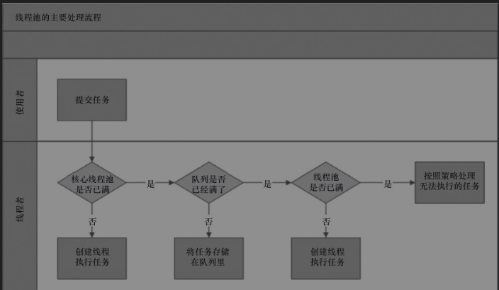


ThreadPoolExecutor执行execute方法分下面4种情况。

- 1）如果当前运行的线程少于corePoolSize，则创建新线程来执行任务（注意，执行这一步骤需要获取全局锁）。
- 2）如果运行的线程等于或多于corePoolSize，则将任务加入BlockingQueue。
- 3）如果无法将任务加入BlockingQueue（队列已满），则创建新的线程来处理任务（注意，执行这一步骤需要获取全局锁）。
- 4）如果创建新线程将使当前运行的线程超出maximumPoolSize，任务将被拒绝，并调用RejectedExecutionHandler.rejectedExecution()方法。

这里为什么大于等于corePoolSize是优先放到阻塞队列里：目的是减少全局锁的竞争，因为放到阻塞队列是不用竞争全局锁的


## 9.3 线程池的使用

### 9.3.1 创建线程池

构造函数 
```java
public ThreadPoolExecutor(int corePoolSize,
                              int maximumPoolSize,
                              long keepAliveTime,
                              TimeUnit unit,
                              BlockingQueue<Runnable> workQueue,
                              ThreadFactory threadFactory,
                              RejectedExecutionHandler handler)
```
- corePoolSize: 核心线程的数量，当提交一个任务到线程池时，当线程数量小于corePoolSize时，进来新任务都会创建新的线程。如果调用了线程池的prestartAllCoreThreads()方法，线程池会提前创建并启动所有核心线程，而不是等到任务进来
- maximumPoolSize：最大线程数量，如果队列满了，已有线程数小于最大线程数，则线程池会再创建新的线程执行任务。值得注意的是，如果使用了无界的任务队列这个参数就没什么效果。
- keepAliveTime： 线程池的工作线程空闲后，保持存活的时间。所以，如果任务很多，并且每个任务执行的时间比较短，可以调大时间，提高线程的利用率。
- unit： 线程保活时间单位
- workQueue： 用于保存等待执行的任务的阻塞队列。可以选择以下几个阻塞队列。ArrayBlockingQueue，LinkedBlockingQueue，SynchronousQueue，PriorityBlockingQueue
- threadFactory：用于设置创建线程的工厂，可以通过线程工厂给每个创建出来的线程设置更有意义的名字。要实现ThreadFactory接口
- handler：拒绝策略，当队列和线程池都满了，说明线程池处于饱和状态，那么必须采取一种策略处理提交的新任务。这个策略默认情况下是AbortPolicy，表示无法处理新任务时抛出异常。jdk有几种默认策略，也可以自定义策略
    - AbortPolicy：直接抛出异常。
    - CallerRunsPolicy：只用调用者所在线程来运行任务。
    - DiscardOldestPolicy：丢弃队列里最近的一个任务，并执行当前任务。
    - DiscardPolicy：不处理，丢弃掉。

这个构造是参数最全的，还有几个重载的方法，有些参数可以不指定用默认值

threadFactory: 默认DefaultThreadFactory，里边没啥处理，搞了一个默认的线程命名规则
handler： 默认是抛出异常


### 9.3.2 向线程池提交任务

 - execute()方法用于提交不需要返回值的任务，所以无法判断任务是否被线程池执行成功

 - submit()方法用于提交需要返回值的任务。线程池会返回一个Future类型的对象，通过这个future对象可以判断任务是否执行成功，并且可以通过future的get()方法来获取返回值，get()方法会阻塞当前线程直到任务完成，而使用get（longtimeout，TimeUnit unit）方法则会阻塞当前线程一段时间后立即返回，这时候有可能任务没有执行完。

### 9.3.3 关闭线程池

可以通过调用线程池的shutdown或shutdownNow方法来关闭线程池。它们的原理是遍历线程池中的工作线程，然后逐个调用线程的interrupt方法来中断线程，所以无法响应中断的任务可能永远无法终止。

shutdown和shutdownNow的区别

- shutdownNow首先将线程池的状态设置成STOP，然后尝试停止所有的正在执行或暂停任务的线程，并返回等待执行任务的列表，

- shutdown只是将线程池的状态设置成SHUTDOWN状态，然后中断所有没有正在执行任务的线程。


只要调用了这两个关闭方法中的任意一个，isShutdown方法就会返回true。当所有的任务都已关闭后，才表示线程池关闭成功，这时调用isTerminaed方法会返回true。至于应该调用哪一种方法来关闭线程池，应该由提交到线程池的任务特性决定，

通常调用shutdown方法来关闭线程池，如果任务不一定要执行完，则可以调用shutdownNow方法。

### 9.3.4 合理地配置线程池

*这一段太重要了，直接把原文抄过来了*


要想合理地配置线程池，就必须首先分析任务特性，可以从以下几个角度来分析。
- 任务的性质：CPU密集型任务、IO密集型任务和混合型任务。
- 任务的优先级：高、中和低。
- 任务的执行时间：长、中和短。
- 任务的依赖性：是否依赖其他系统资源，如数据库连接。


性质不同的任务可以用不同规模的线程池分开处理。CPU密集型任务应配置尽可能小的线程，如配置Ncpu+1个线程的线程池。由于IO密集型任务线程并不是一直在执行任务，则应配置尽可能多的线程，如2*Ncpu。混合型的任务，如果可以拆分，将其拆分成一个CPU密集型任务和一个IO密集型任务，只要这两个任务执行的时间相差不是太大，那么分解后执行的吞吐量将高于串行执行的吞吐量。如果这两个任务执行时间相差太大，则没必要进行分解。可以通过Runtime.getRuntime().availableProcessors()方法获得当前设备的CPU个数。优先级不同的任务可以使用优先级队列PriorityBlockingQueue来处理。它可以让优先级高的任务先执行。


*如果一直有优先级高的任务提交到队列里，那么优先级低的任务可能永远不能执行。*

执行时间不同的任务可以交给不同规模的线程池来处理，或者可以使用优先级队列，让执行时间短的任务先执行。

依赖数据库连接池的任务，因为线程提交SQL后需要等待数据库返回结果，等待的时间越长，则CPU空闲时间就越长，那么线程数应该设置得越大，这样才能更好地利用CPU。

建议使用有界队列


### 9.3.5 线程池的监控


如果在系统中大量使用线程池，则有必要对线程池进行监控，方便在出现问题时，可以根据线程池的使用状况快速定位问题。可以通过线程池提供的参数进行监控，在监控线程池的时候可以使用以下属性。

- taskCount：线程池需要执行的任务数量。

- completedTaskCount：线程池在运行过程中已完成的任务数量，小于或等于taskCount。

- largestPoolSize：线程池里曾经创建过的最大线程数量。通过这个数据可以知道线程池是否曾经满过。如该数值等于线程池的最大大小，则表示线程池曾经满过。
- getPoolSize：线程池的线程数量。如果线程池不销毁的话，线程池里的线程不会自动销毁，所以这个大小只增不减。
- getActiveCount：获取活动的线程数。通过扩展线程池进行监控。

可以通过继承线程池来自定义线程池，重写线程池的beforeExecute、afterExecute和terminated方法，也可以在任务执行前、执行后和线程池关闭前执行一些代码来进行监控。例如，监控任务的平均执行时间、最大执行时间和最小执行时间等。这几个方法在线程池里是空方法。


# 第10章 Executor框架

本章其实就是把整个线程池的体系介绍了一遍

列个大纲吧

10.1 Executor框架简介
10.1.1 Executor框架的两级调度模型
10.1.2 Executor框架的结构与成员
1. Executor框架的结构
2. Executor框架的成员
（1）ThreadPoolExecutor
（2）FixedThreadPool
（3）SingleThreadExecutor   
（4）CachedThreadPool
（5）ScheduledThreadPoolExecutor
（6）SingleThreadScheduledExecutor

- Future接口与FutureTask
- Runnable接口和Callable接口
- FutureTask的实现


# 第11章 Java并发编程实践


## 11.1 生产者消费者模式

### 11.1.1 一个例子

一个提取邮件，处理邮件入库的例子

### 11.1.2 多生产者、多消费者的例子

在一个长连接服务器中使用了这种模式，生产者1负责将所有客户端发送的消息存放在阻塞队列1里，消费者1从队列里读消息，然后通过消息ID进行散列得到N个队列中的一个，然后根据编号将消息存放在到不同的队列里，每个阻塞队列会分配一个线程来消费阻塞队列里的数据。如果消费者2无法消费消息，就将消息再抛回到阻塞队列1中，交给其他消费者处理。

### 11.1.3 其他的例子

- 上传附件并处理，用户把文件上传到系统后，系统把文件丢到队列里，然后立刻返回告诉用户上传成功，最后消费者再去队列里取出文件处理。
- 再如，调用一个远程接口查询数据，如果远程服务接口查询时需要几十秒的时间，那么它可以提供一个申请查询的接口，这个接口把要申请查询任务放数据库中，然后该接口立刻返回。然后服务器端用线程轮询并获取申请任务进行处理，处理完之后发消息给调用方，让调用方再来调用另外一个接口取数据。

## 11.2 线上问题定位

### top命令：

可以查看每个进程的资源占用情况

各个列的含义：

- PID  进程号
- USER 用户名
- NI   nice值。负值表示高优先级，正值表示低优先级m 
- RES  进程使用的、未被换出的物理内存大小，单位kb
- SHR      共享内存大小，单位kb
 - S        进程状态。
    - D=不可中断的睡眠状态
    - R=运行
    - S=睡眠
    - T=跟踪/停止
    - Z=僵尸进程
- %CPU  CPU使用率
- %MEM     进程使用的物理内存百分比
- TIME+    进程使用的CPU时间总计，单位1/100秒
- COMMAND 执行的命令 java进程就是java

参考[linux中top命令下显示出的PR\NI\RES\SHR\S\%MEM TIME+都代表什么](https://blog.csdn.net/lxpbs8851/article/details/8229468)

进入top交互命令后按1可以看每个cpu的性能数据

使用top的交互命令H查看每个线程的性能信息。

可能出现一些不正常的情况

- 第一种情况，某个线程CPU利用率一直100%，则说明是这个线程有可能有死循环，那么请记住这个PID。
- 第二种情况，某个线程一直在TOP 10的位置，这说明这个线程可能有性能问题。
- 第三种情况，CPU利用率高的几个线程在不停变化，说明并不是由某一个线程导致CPU偏高。

第一种情况有可能是GC造成，可以用jstat命令看一下GC情况，看看是不是因为持久代或年老代满了，产生Full GC，导致CPU利用率持续飙高

此时可以用jstat查看gc的情况

```
/usr/java/jdk1.8.0_241-i586/bin/jstat -gc 1342 1000 5
```

其中 1342 标识pid, 1000表示1000毫秒采样一次，5表示一共采样5次

在得到的结果中

```
S0C、S1C、S0U、S1U：Survivor 0/1区容量（Capacity）和使用量（Used）
EC、EU：Eden区容量和使用量
OC、OU：年老代容量和使用量
PC、PU：永久代容量和使用量
YGC、YGT：年轻代GC次数和GC耗时
FGC、FGCT：Full GC次数和Full GC耗时
GCT：GC总耗时
```

也可以把线程dump下来看哪个线程执行这么导致cpu占用率高

```
/usr/java/jdk1.8.0_241-i586/bin/jstack 1342 > /home/dump0
```

把异常继承id转为16进制，然后在dump里找

### 性能测试

- 查看网络流量

```
cat /proc/net/dev
```
- 查看系统平均负载。

```
cat /proc/loadavg
```
- 查看系统内存情况
```
cat /proc/meminfo
```

- 查看cpu利用率

```
cat /proc/stat
```

### 11.3 异步任务池

如果一个任务仍进线程池之后，运行线程池的程序重启了，那么线程池里的任务就会丢失。另外，线程池只能处理本机的任务，在集群环境下不能有效地调度所有机器的任务。


任务池的主要处理流程是，每台机器会启动一个任务池，每个任务池里有多个线程池，当某台机器将一个任务交给任务池后，任务池会先将这个任务保存到数据中，然后某台机器上的任务池会从数据库中获取待执行的任务，再执行这个任务。


## 提到的工具

- jstack
- javap


