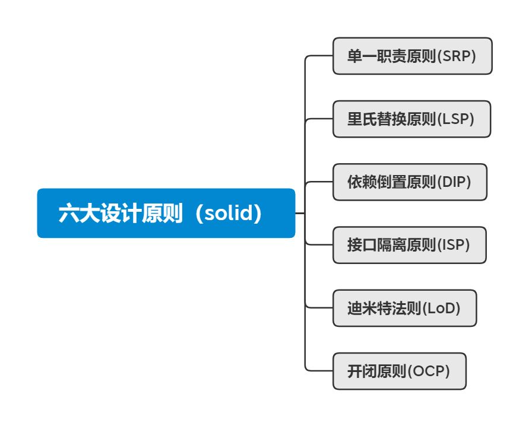

# 6大设计原则

## 单一职责原则（Single Responsibility Principle，SRP）

定义：应该有且仅有一个原因引起类的变更

意义：

1. 类的复杂性降低，实现什么职责都有清晰明确的定义
2. 可读性提高
3. 可维护性提高
4. 变更引起的风险降低

使用注意：

1. 是一种很难衡量的模式，需要根据具体业务来，而不是越细越好
2. 需要衡量可变因素和不可变因素，以及相关的收益成本比率
3. 接口一定要做到单一职责，类的设计尽量做到只有一个原因引起变化

## 里氏替换原则(Liskov Substitution Principle, LSP)

定义：

1. 如果对每一个类型为S的对象o1，都有类型为T的对象o2，使得以T定义的所有程序P在所有的对象o1都代换成o2时，程序P的行为没有发生变化，那么类型S是类型T的子类型。
2. 所有引用基类的地方必须能透明地使用其子类的对象

所有引用父类的地方，换成父类的任意子类都可以正常工作

里氏替换原则对继承的规范要求：

1. 子类必须完全实现父类的方法
2. 子类可以有自己新的方法
3. 覆盖或实现父类的方法时输入参数可以被放大（参数类型 范围放大）
4. .覆写或实现父类的方法时输出结果可以被缩小（返回类型可以为父类方法的子类型）

## 依赖倒置原则(Dependence Inversion Principle,DIP)

定义：

1. 高层模块不应该依赖低层模块，两者都应该依赖其抽象
2. 抽象不应该依赖细节
3. 细节应该依赖抽象

在java中的表现：

1. 模块间的依赖通过抽象发生，实现类之间不发生直接的依赖关系，其依赖关系是通过接口或抽象类产生的
2. 接口或抽象类不依赖于实现类
3. 实现类依赖接口或抽象类

实质就是面向接口编程

意义：

1. 可以减少类间的耦合性
2. 提高系统的稳定
3. 降低并行开发引起的风险
4. 提高代码的可读性和可维护性

作者在这里使用了一个司机、宝马、奔驰的例子进行了阐述。

依赖的三种方法：

1. 构造函数传递依赖对象
2. setter方法注入依赖对象
3. 接口声明依赖对象，也叫接口注入（其实就是在调用方法时传入依赖对象）

## 接口隔离原则（Interface Segregation Principle, ISP）

定义：

1. 客户端不应该依赖它不需要的接口
2. 类间的依赖关系应该建立在最小的接口上

建立单一接口，不要建立臃肿庞大的接口。即接口尽量细化，同时接口中的方法尽量少

违背接口隔离原则的坏处：

书中举了一个美女接口，并以美女标准变更说明了将多个方法放到一个接口难以适应变化

接口隔离原则对接口设计规范的要求：

1. 接口要尽量小
2. 接口要高内聚
3. 定制服务
4. 接口设计是有限度的

## 迪米特法则（Law of Demeter，LoD）或最少知识原则（Least KnowledgePrinciple，LKP）

定义：

一个对象应该对其他对象有最少的了解

意义：

解耦，方便维护

原则：

1. 只与直接依赖的对象通信
2. 对象之间的依赖应该尽可能少的暴露内部细节

## 开闭原则（Open Close Principle， OCP）

定义：

一个软件实体如类、模块和函数应该对扩展开放，对修改关闭。

开闭原则告诉我们应尽量通过扩展软件实体的行为来实现变化，而不是通过修改已有的代码来完成变化

意义：

有助于构建稳定的、灵活的系统

开闭原则的案例：

书中给出了销售书的一个案例，变化是需要打折，此时如何处理的问题，给出的最优放方法是继承原来的书，重写其getPrice方法

使用开闭原则的原因：

开闭原则是最基础的一个原则。其他设计原则都是开闭原则的具体形态，也就是说其他原则就是指导设计的工具和方法，而开闭原则才是其精神领袖

开闭原则的重要性体现：

1. 开闭原则对测试的影响
2. 开闭原则可以提高复用性
3. 开闭原则可以提高可维护性
4. 面向对象开发的要求

如何使用开闭原则：

1. 抽象约束
    - 通过接口或抽象类约束扩展，对扩展进行边界限定，不允许出现在接口或抽象类中不存在的public方法
    - 参数类型、引用对象尽量使用接口或者抽象类
    - 抽象层尽量保持稳定，一旦确定即不允许修改
2. 元数据（metadata）控制模块行为

用来描述环境和数据的数据，通俗地说就是配置参数，参数可以从文件中获得，也可以从数据库中获得

3. 制定项目章程

4. 封装变化

    - 将相同的变化封装到一个接口或抽象类中
    - 将不同的变化封装到不同的接口或抽象类中，不应该有两个不同的变化出现在同一个接口或抽象类中
